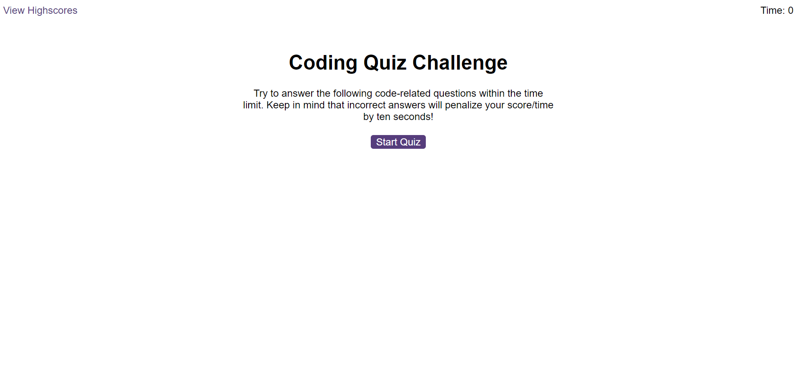

# Code Quiz

## Description

This app is a quiz with questions all about coding.  The idea is to help test the progression of bootcamp students so they can gauge their progress.  Most of this app was built with JavaScript with a small amount of HTML and CSS.  Some of the HTML is generated via the JavaScript code.

Some of the challenges I had during this project were minor things that just required minor code changes, things like getting stuck in loops, looping inside loops.  The parts where the loops weren't working, I soon discovered I didn't actually need the loops, a few if statements and an event listener for a click allowed me to build the project as needed.

The biggest issue I faced was trying to store scores in the localStorage, I tried a few ideas that I had but the data kept getting overwritten or wouldn't save how I wanted it to.  I then turned to Google and found an article about saving high scores in localStorage, the link has been added to the Credits section.

This project really helped me to learn and get to grips with the web API topic, now having worked with this over and over during this project, I have grasped a better understanding of it.  I can now happily work with query selectors and setting attributes, for example.

There are a couple of features I would like to add, making the questions and answers appear in a different order each time the quiz is played would be a good improvement, and also adding key events for the user to press number 1 - 4 on the keyboard for the relevant answer for each question, instead of clicking the answer.

## Table of Contents

- [Installation](#installation)
- [Usage](#usage)
  - [Start Screen](#start-screen)
  - [Quiz Rules](#quiz-rules)
  - [Questions Screen](#questions-screen)
  - [Finish Screen](#finish-screen)
  - [Highscores Page](#highscores-page)
- [Credits](#credits)
- [License](#license)

##  Installation

Following this link will take you to the Code Quiz: [Code Quiz](https://nickmbk.github.io/code-quiz/)

## Usage

When the web page loads you will begin at the Start Screen

### Start Screen

In the top left corner of the screen is the View Highscores link which will take you to the Highscores Page where you will find a list of scores from previous players in order of highest to lowest.

In the top right corner you will see the timer, you get 75 seconds to answer all the questions.

In the centre of the screen, there is a purple Start Quiz button, click this to begin the quiz.  As soon as you click the Start Quiz button the timer will begin to count down.

### Quiz Rules

There are 10 questions to be answered, answer each one by clicking on the answer you want to select.  If the answer is wrong 10 seconds will be taken off the timer and you will move on to the next question.  If you answer correctly you will simply be taken to the next question.

When you have answered all the questions or the timer reaches zero, the quiz will end.  The time that is left on the clock is your score.  The more questions you get right, the higher your score will be.

### Questions Screen

The first question will appear at the top of the screen, along with four answers underneath.  Read the question and click the answer you think is correct.  When you've clicked your answer, a message will display, a sound will play and the next question will be displayed.

### Finish Screen

When the quiz has finished you will be presented with your score and you can add your initials to be saved in the highscores.  The initials must be 2 or 3 characters.  When you have enetered your initials click Submit and you will be taken to the Highscores page.

### Highscores Page

This page displays a list of previously saved highscores from highest to lowest.

To clear the highscores list, click on the Clear Highscores button, you will be asked to confirm you want to clear the highscores.  Once this is done, it can't be undone.

Click on the Go Back button to go back to the Start Screen.

## Credits

I used a few resources for this project, a few of which were MDN pages to check I was using the correct syntax, for working with localStorage, querySelector/querySelectorAll and createElement/append.

[MDN - localStorage](https://developer.mozilla.org/en-US/docs/Web/API/Window/localStorage)

[MDN - querySelector](https://developer.mozilla.org/en-US/docs/Web/API/Document/querySelector)
[MDN - querySelectorAll](https://developer.mozilla.org/en-US/docs/Web/API/Document/querySelectorAll)

[MDN - createElement](https://developer.mozilla.org/en-US/docs/Web/API/Document/createElement)
[MDN - append](https://developer.mozilla.org/en-US/docs/Web/API/Element/append)

I was trying to find a way to concatenate a string with a variable in order to select a class with querySelector, but everything I tried, nothing seemed to be working, I found a Stack Overflow post that answered my question

[Use variables in querySelector - Stack Overflow](https://stackoverflow.com/questions/37081721/use-variables-in-document-queryselector)

I had some trouble with saving scores in localStorage, the things I tried kept overwriting what was already saved, I foun a Medium article that explained specifically saving scores, so I adapted some of the article to use in my code

[How to save high scores in localStorage - Michael Karen - Medium](https://michael-karen.medium.com/how-to-save-high-scores-in-local-storage-7860baca9d68)

## License

I used no license for this project.